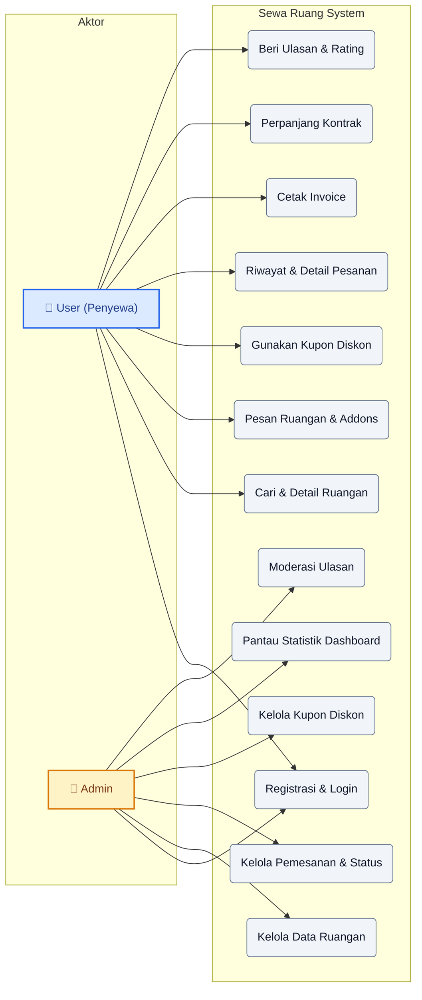
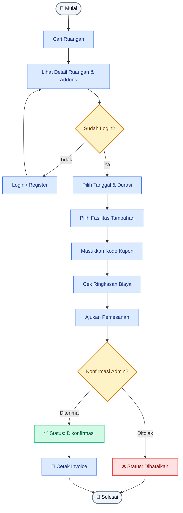
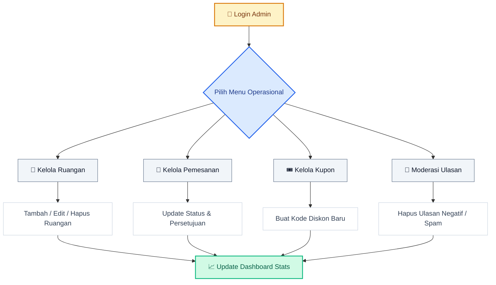
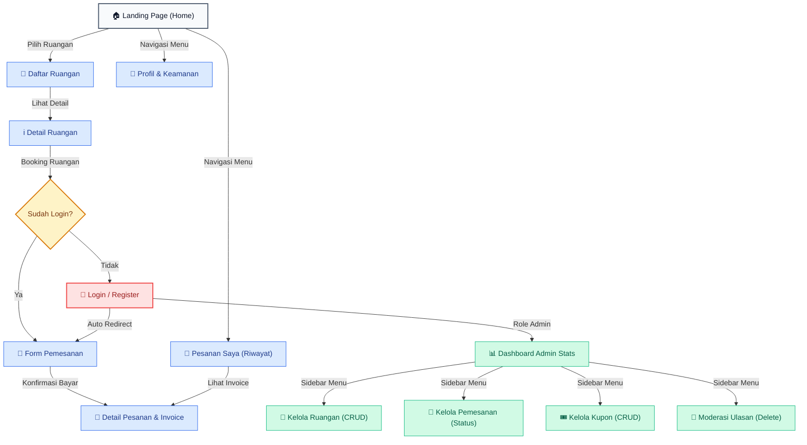

# 🏢 Sewa Ruang - Office Booking Platform

**Sewa Ruang** adalah platform modern berbasis web untuk menyewa berbagai jenis ruang kerja, mulai dari Private Office, Coworking Space, hingga Meeting Room eksklusif. Aplikasi ini dirancang untuk memberikan pengalaman pemesanan yang cepat, transparan, dan efisien bagi pengguna maupun admin.

---

## 🚀 Fitur Utama

### 👤 Untuk Pengguna (Penyewa)

- **Daftar Ruangan**: Telusuri berbagai jenis ruangan dengan kategori yang lengkap.
- **Ruangan Populer**: Akses cepat ke ruangan-ruangan terbaik yang paling banyak diminati.
- **Booking System & Addons**: Pesan ruangan dengan opsi fasilitas tambahan (WiFi, Kopi, dll) dengan penanganan state kosong yang informatif.
- **Promo & Kupon**: Gunakan kode diskon (persentase/nominal) untuk harga lebih hemat.
- **Riwayat & Invoice**: Pantau status pesanan dan unduh invoice resmi dalam format PDF.
- **Perpanjang Kontrak**: Fitur sekali klik untuk memperpanjang masa sewa ruangan.
- **Ulasan & Rating**: Berikan testimoni dan bintang setelah pesanan dikonfirmasi.
- **Profil & Keamanan**: Kelola data diri dan fitur lupa password via SMTP dengan tombol kembali ke Landing Page yang ramah mobile.

### 🔐 Untuk Admin

- **Robust Dashboard**: Statistik pendapatan, jumlah pesanan, dan ruangan secara real-time.
- **Manajemen Ruangan**: Tambah, edit, dan hapus data ruangan (CRUD) beserta gambar.
- **Manajemen Pemesanan**: Kelola alur konfirmasi dan pembatalan pesanan secara efisien.
- **Sistem Kupon**: Buat dan kelola kode promo dengan limit penggunaan dan tanggal kadaluarsa.
- **Moderasi Ulasan**: Kontrol testimoni pengguna untuk menjaga kualitas platform.

### 📱 Keunggulan & Stabilisasi UX Modern

- **Mobile Card-List Layout**: Menggantikan tabel horizontal tradisional pada resolusi ponsel dengan **Daftar Kartu Informasi** vertikal otomatis. Tidak perlu menggeser (swipe-X) layar lagi di perangkat ponsel!
- **Bulletproof Redirection (Anti-Crash)**: Penanganan data `404 Not Found` yang tangguh pada detail pesanan. Menghindari crash atau loading tak terbatas (*"Memuat..."*) jika mengakses pesanan yang telah dihapus melalui tautan notifikasi lama.
- **Sistem Notifikasi Cerdas & Modal Popup**: Admin dan pengguna akan menerima modal pemberitahuan informatif jika diarahkan kembali karena tautan pesanan usang.
- **Aksi Tombol Konsisten**: Penggunaan standar tombol aksi outline lingkaran berukuran tetap (`36px` × `36px`) baik untuk opsi edit/detail (`.btn-outline`) maupun hapus (`.btn-outline-danger`) untuk menghindari asimetris layout.
- **Navbar Terpadu**: Tombol Bell Notifikasi dan Theme Switcher berdimensi presisi (`42px` × `42px`) dengan perataan tengah ikon yang sempurna.

---

## 🛠️ Teknologi yang Digunakan

| Komponen             | Teknologi                                  |
| :------------------- | :----------------------------------------- |
| **Frontend**         | React.js (Vite), Lucide Icons, Vanilla CSS |
| **Backend**          | Laravel 11 (RESTful API)                   |
| **Database**         | MySQL (with **Navicat** as GUI)            |
| **Containerization** | Docker & Docker Compose                    |
| **State Management** | React Context API                          |
| **Monitoring**       | Grafana, Prometheus, Loki, Promtail        |

---

## 📦 Instalasi (Menggunakan Docker)

Pastikan Anda sudah menginstal **Docker Desktop**, **Docker Compose**, dan **WSL (Windows Subsystem for Linux)** di perangkat Anda agar Docker dapat berjalan dengan lancar (khusus pengguna Windows).

1.  **Clone Repository**

    ```bash
    git clone https://github.com/Fdlnahmd/office-rent.git
    cd office-rent
    ```

2.  **Jalankan Container**

    ```bash
    docker-compose up -d --build
    ```

3.  **Persiapan Database & Data Testing (Seeding)**

    ```bash
    docker-compose exec backend php artisan migrate:fresh --seed
    ```

    > [!TIP]
    > Untuk mengaktifkan fitur **Lupa Password**, pastikan Anda telah mengonfigurasi `MAIL_USERNAME` dan `MAIL_PASSWORD` di file `.env` menggunakan akun SMTP (seperti Gmail App Password).

4.  **Akses Aplikasi**
    - **Frontend**: [http://localhost](http://localhost)
    - **Backend API**: [http://localhost:8000](http://localhost:8000)
    - **Mobile Preview**: [http://localhost:8080](http://localhost:8080)

    Port dapat diubah melalui file `.env`, misalnya `FRONTEND_PORT`, `BACKEND_PORT`, `MOBILE_PORT`, dan `GRAFANA_PORT`.

---

## Monitoring & Observability

Project ini dilengkapi stack monitoring berbasis Docker untuk memantau data bisnis, metrik container, dan log Laravel.

### Komponen Monitoring

| Komponen                  | Fungsi                                                                 |
| :------------------------ | :--------------------------------------------------------------------- |
| **Grafana**               | Dashboard utama untuk membaca data MySQL, metrik Prometheus, dan log Loki |
| **Prometheus**            | Menyimpan metrik time-series container                                 |
| **Docker Stats Exporter** | Mengambil statistik container dari Docker socket                       |
| **Loki**                  | Menyimpan dan mencari log aplikasi                                     |
| **Promtail**              | Membaca `backend/storage/logs/*.log` dan mengirimkannya ke Loki         |

### Akses Monitoring

| Service                   | URL Default                              |
| :------------------------ | :--------------------------------------- |
| **Grafana**               | [http://localhost:3000](http://localhost:3000) |
| **Prometheus**            | [http://localhost:9090](http://localhost:9090) |
| **Docker Stats Exporter** | [http://localhost:9104/metrics](http://localhost:9104/metrics) |
| **Loki Ready Check**      | [http://localhost:3100/ready](http://localhost:3100/ready) |

Login default Grafana mengikuti `.env`:

```env
GRAFANA_ADMIN_USER=admin
GRAFANA_ADMIN_PASSWORD=admin
```

> [!WARNING]
> Jika Grafana dibuka ke internet, ganti `GRAFANA_ADMIN_PASSWORD` dengan password yang kuat dan gunakan Cloudflare Access atau proteksi sejenis.

### Dashboard Grafana

- **Office Rent Overview**: metrik bisnis dari MySQL, seperti revenue, booking aktif, booking pending, user terdaftar, ruangan populer, dan booking terbaru.
- **Office Rent Observability**: metrik teknis seperti status container, CPU, memory, network I/O, log Laravel, dan jumlah error/exception.

### Alur Data Monitoring

```text
MySQL -> Grafana
Docker containers -> Docker Stats Exporter -> Prometheus -> Grafana
backend/storage/logs/*.log -> Promtail -> Loki -> Grafana
```

### Online Lewat Cloudflare

Grafana dapat di-online-kan lewat Cloudflare Tunnel tanpa membuka port publik server. Atur `.env`:

```env
GRAFANA_DOMAIN=grafana.example.com
GRAFANA_ROOT_URL=https://grafana.example.com
GRAFANA_ENFORCE_DOMAIN=true
GRAFANA_COOKIE_SECURE=true
```

Lalu di Cloudflare Zero Trust, tambahkan Public Hostname dengan service:

```text
http://grafana:3000
```

Panduan lebih lengkap tersedia di [docs/grafana.md](docs/grafana.md).

---

## 🔑 Akun Demo (Default Seeder)

| Role      | Email               | Password |
| :-------- | :------------------ | :------- |
| **Admin** | admin@sewaruang.com | password |
| **User**  | budi@gmail.com      | password |

---

## 📐 Arsitektur & Alur Kerja (Mermaid Diagram)

Platform ini dilengkapi dengan pemetaan arsitektur interaktif langsung menggunakan **Mermaid** untuk rendering visual native di GitHub/GitLab.

### 🎭 Use Case Diagram



<details>
<summary>🖼️ Lihat Gambar Static (Fallback)</summary>


</details>

### 🌊 Flowchart: Alur Pemesanan Ruangan



<details>
<summary>🖼️ Lihat Gambar Static (Fallback)</summary>


</details>

### 📊 Flowchart: Alur Kelola Admin



<details>
<summary>🖼️ Lihat Gambar Static (Fallback)</summary>


</details>

### 🗺️ Peta Navigasi Halaman (Web Sitemap)



<details>
<summary>🖼️ Lihat Gambar Static (Fallback)</summary>


</details>

Detail lebih lanjut dan kode Mermaid interaktif dapat dilihat pada dokumentasi internal:
👉 [diagram_arsitektur.md](docs/diagram_arsitektur.md)

---

## 📄 Lisensi

Proyek ini dilisensikan di bawah [MIT License](LICENSE).

---

_Dibuat dengan ❤️ oleh Fadlan Achmad Frizal_
