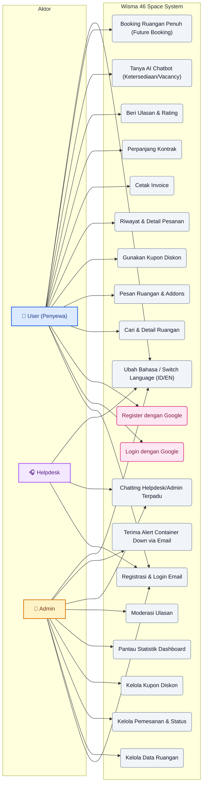
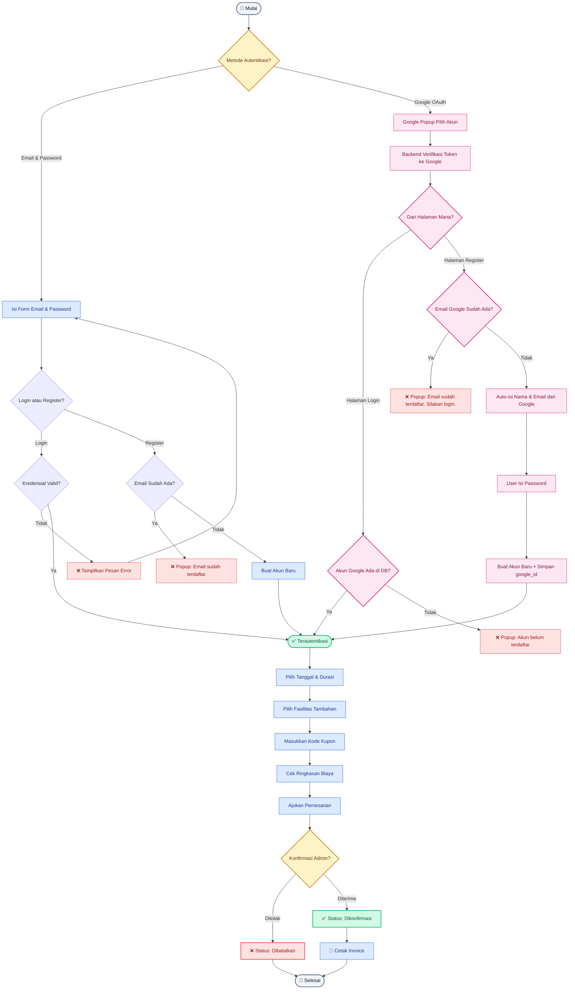
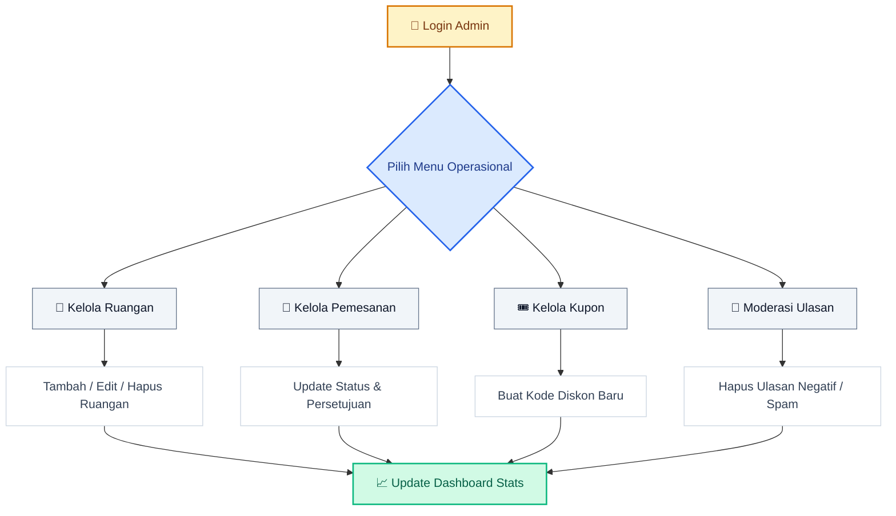
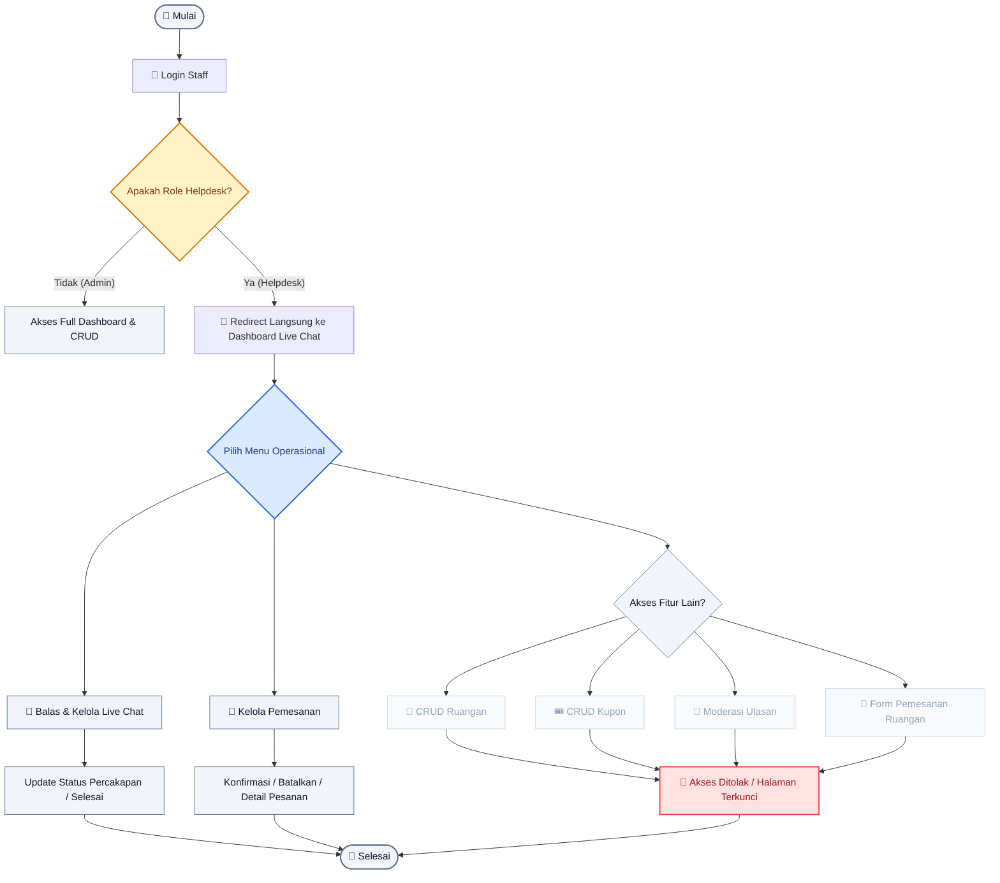
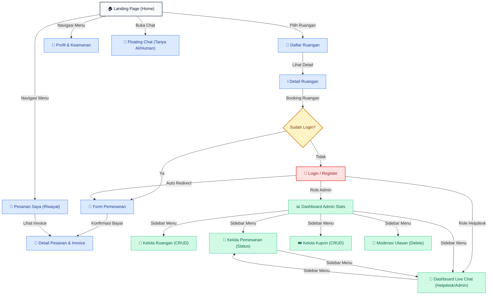

# 📐 Arsitektur & Alur Sistem - Wisma 46 Space

Dokumen ini menjelaskan alur kerja dan arsitektur dari platform **Wisma 46 Space**.

---

## 🎭 Use Case Diagram

Diagram ini menjelaskan interaksi antara aktor (User & Admin) dengan sistem.

---

## 🌊 Flowchart: Alur Pemesanan Ruangan

Alur dari pencarian ruangan hingga pembayaran dan konfirmasi.

---

## 📊 Flowchart: Alur Kelola Admin

Alur admin dalam mengelola operasional platform.

---

## 🎧 Flowchart: Alur Kelola Helpdesk

Alur kerja petugas support / Helpdesk dalam membalas chat dan memantau pemesanan ruangan.

---

## 🗺️ Peta Navigasi Halaman (Web Sitemap / Page Flowchart)

Diagram ini menggambarkan peta navigasi situs web, dari Landing Page menuju berbagai sub-halaman pengguna dan panel dashboard admin.

---

## 3. Penjelasan Singkat

### Aktor Utama:
1.  **User (Penyewa)**: Fokus pada pencarian ruangan kerja yang sesuai kebutuhan, melakukan transaksi pemesanan secara mandiri (termasuk pemesanan di masa depan untuk ruangan yang sedang penuh), berkonsultasi via Live Chat/AI Chatbot, serta login/register menggunakan email+password **atau akun Google**.
2.  **Helpdesk**: Bertugas khusus sebagai customer support untuk membalas pesan obrolan (live chat) dari penyewa secara real-time.
3.  **Admin**: Bertugas penuh menjaga ketersediaan data ruangan (CRUD), memantau statistik dashboard, mengelola pemesanan, moderasi ulasan, membalas chat, serta memantau alerting container jika terjadi downtime.

### Alur Utama (Autentikasi):
Sistem mendukung dua metode autentikasi:
- **Email & Password**: Login dan Register biasa dengan validasi backend.
- **Google OAuth (One Tap)**: Di halaman **Login**, jika akun ditemukan langsung terautentikasi. Di halaman **Register**, jika akun sudah ada maka muncul popup info; jika belum ada, nama & email auto-isi dari Google dan user diminta mengatur password baru.

### Alur Utama (Booking):
Sistem memastikan pengguna sudah terautentikasi sebelum melakukan pemesanan. Jika ruangan sedang disewa, sistem akan menampilkan notifikasi informatif berisi tanggal akhir sewa saat ini dan menyarankan tanggal mulai baru pada H+1 sewa selesai. Proses validasi bentrokan tanggal dilakukan di backend secara real-time untuk menjamin integritas transaksi sewa.
