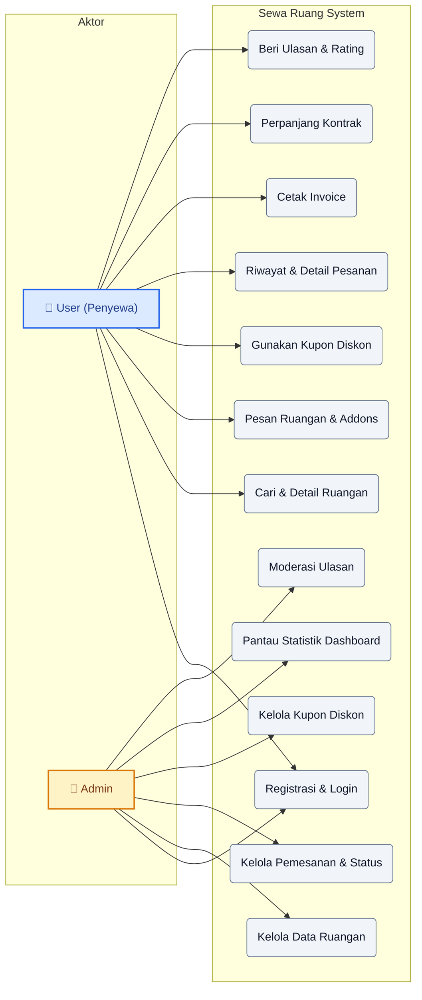
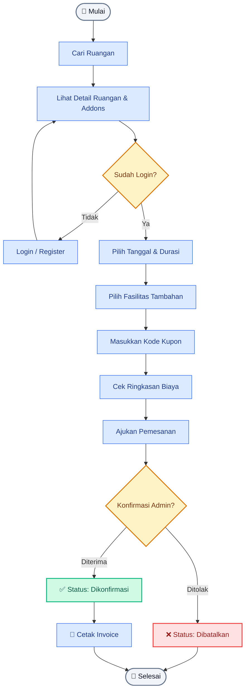
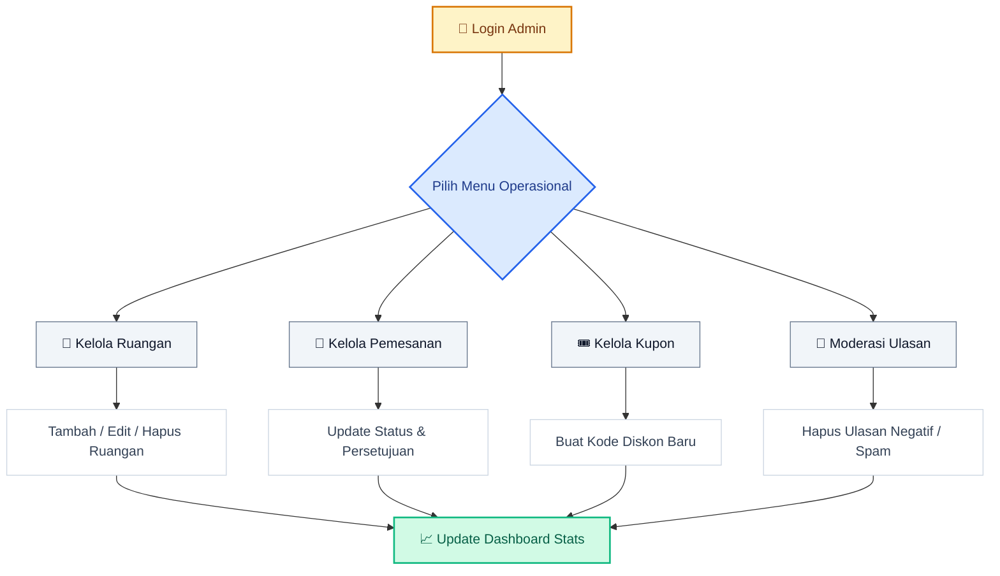
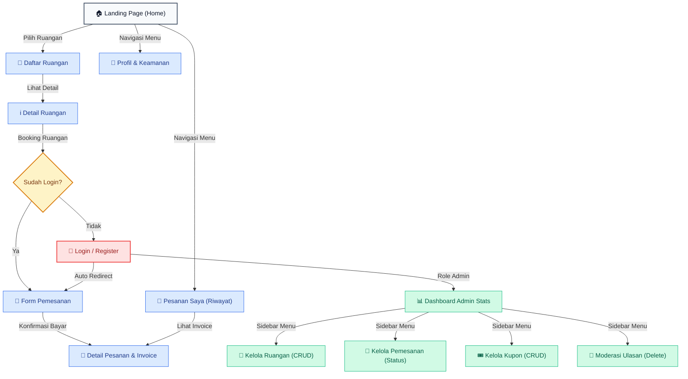

# 📐 Arsitektur & Alur Sistem - Sewa Ruang

Dokumen ini menjelaskan alur kerja dan arsitektur dari platform **Sewa Ruang**.

---

## 🎭 Use Case Diagram

Diagram ini menjelaskan interaksi antara aktor (User & Admin) dengan sistem.

💻 Lihat Kode Mermaid (Use Case Diagram)

---

## 🌊 Flowchart: Alur Pemesanan Ruangan

Alur dari pencarian ruangan hingga pembayaran dan konfirmasi.

💻 Lihat Kode Mermaid (Flowchart Pemesanan Ruangan)

---

## 📊 Flowchart: Alur Kelola Admin

Alur admin dalam mengelola operasional platform.

💻 Lihat Kode Mermaid (Flowchart Kelola Admin)

---

## 🗺️ Peta Navigasi Halaman (Web Sitemap / Page Flowchart)

Diagram ini menggambarkan peta navigasi situs web, dari Landing Page menuju berbagai sub-halaman pengguna dan panel dashboard admin.

💻 Lihat Kode Mermaid (Peta Navigasi Halaman)

---

## 3. Penjelasan Singkat

### Aktor Utama:
1.  **User (Penyewa)**: Fokus pada pencarian ruangan kerja yang sesuai kebutuhan dan melakukan transaksi pemesanan secara mandiri.
2.  **Admin**: Bertugas menjaga ketersediaan data ruangan, memantau statistik di dashboard, dan mengelola status pemesanan yang masuk.

### Alur Utama (Booking):
Sistem memastikan pengguna sudah terautentikasi sebelum melakukan pemesanan. Proses validasi dilakukan di sisi backend untuk memastikan data (seperti tanggal dan durasi) sudah benar sebelum disimpan ke database.
