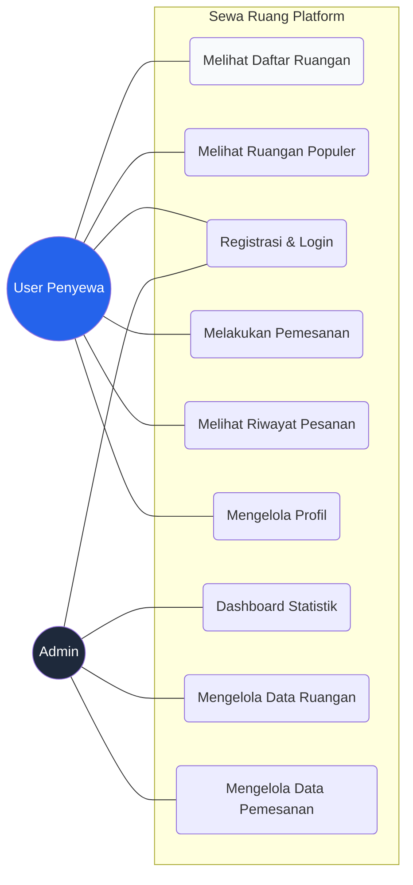
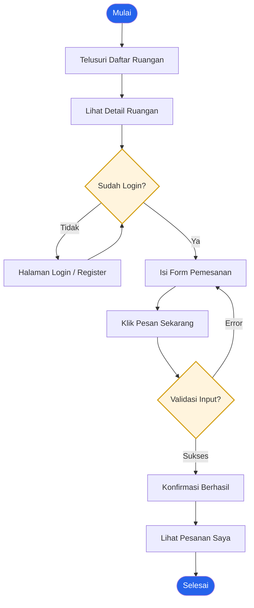

# 📊 Diagram Arsitektur Sewa Ruang

Dokumen ini menjelaskan interaksi pengguna dan alur kerja utama dalam platform Sewa Ruang.

---

## 1. Use Case Diagram
Diagram ini menunjukkan hubungan antara pengguna (**User** & **Admin**) dengan fitur-fitur yang tersedia di sistem.

---

## 2. Flowchart: Alur Pemesanan Ruangan
Diagram ini menjelaskan langkah-langkah yang dilalui pengguna dari mencari ruangan hingga berhasil melakukan pemesanan.

---

## 3. Penjelasan Singkat

### Aktor Utama:
1.  **User (Penyewa)**: Fokus pada pencarian ruangan kerja yang sesuai kebutuhan dan melakukan transaksi pemesanan secara mandiri.
2.  **Admin**: Bertugas menjaga ketersediaan data ruangan, memantau statistik di dashboard, dan mengelola status pemesanan yang masuk.

### Alur Utama (Booking):
Sistem memastikan pengguna sudah terautentikasi sebelum melakukan pemesanan. Proses validasi dilakukan di sisi backend untuk memastikan data (seperti tanggal dan durasi) sudah benar sebelum disimpan ke database.
