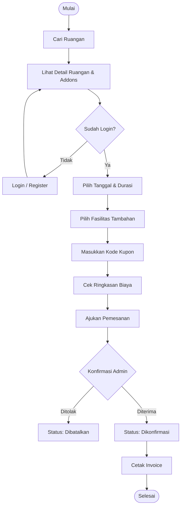
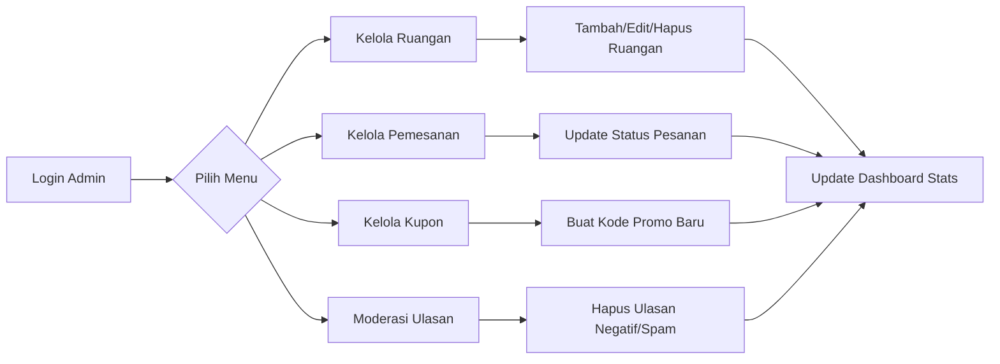

# 📐 Arsitektur & Alur Sistem - Sewa Ruang

Dokumen ini menjelaskan alur kerja dan arsitektur dari platform **Sewa Ruang**.

---

## 🎭 Use Case Diagram

Diagram ini menjelaskan interaksi antara aktor (User & Admin) dengan sistem.

```mermaid
useCaseDiagram
    actor "User (Penyewa)" as U
    actor "Admin" as A

    package "Sewa Ruang System" {
        usecase "Registrasi & Login" as UC1
        usecase "Cari & Detail Ruangan" as UC2
        usecase "Pesan Ruangan & Addons" as UC3
        usecase "Gunakan Kupon Diskon" as UC4
        usecase "Riwayat & Detail Pesanan" as UC5
        usecase "Cetak Invoice" as UC6
        usecase "Perpanjang Kontrak" as UC7
        usecase "Beri Ulasan & Rating" as UC8
        
        usecase "Kelola Data Ruangan" as UC9
        usecase "Kelola Pemesanan & Status" as UC10
        usecase "Kelola Kupon Diskon" as UC11
        usecase "Pantau Statistik Dashboard" as UC12
        usecase "Moderasi Ulasan" as UC13
    }

    U --> UC1
    U --> UC2
    U --> UC3
    U --> UC4
    U --> UC5
    U --> UC6
    U --> UC7
    U --> UC8

    A --> UC1
    A --> UC9
    A --> UC10
    A --> UC11
    A --> UC12
    A --> UC13
```

---

## 🌊 Flowchart: Alur Pemesanan Ruangan

Alur dari pencarian ruangan hingga pembayaran dan konfirmasi.



---

## 📊 Flowchart: Alur Kelola Admin

Alur admin dalam mengelola operasional platform.



---

## 3. Penjelasan Singkat

### Aktor Utama:
1.  **User (Penyewa)**: Fokus pada pencarian ruangan kerja yang sesuai kebutuhan dan melakukan transaksi pemesanan secara mandiri.
2.  **Admin**: Bertugas menjaga ketersediaan data ruangan, memantau statistik di dashboard, dan mengelola status pemesanan yang masuk.

### Alur Utama (Booking):
Sistem memastikan pengguna sudah terautentikasi sebelum melakukan pemesanan. Proses validasi dilakukan di sisi backend untuk memastikan data (seperti tanggal dan durasi) sudah benar sebelum disimpan ke database.
