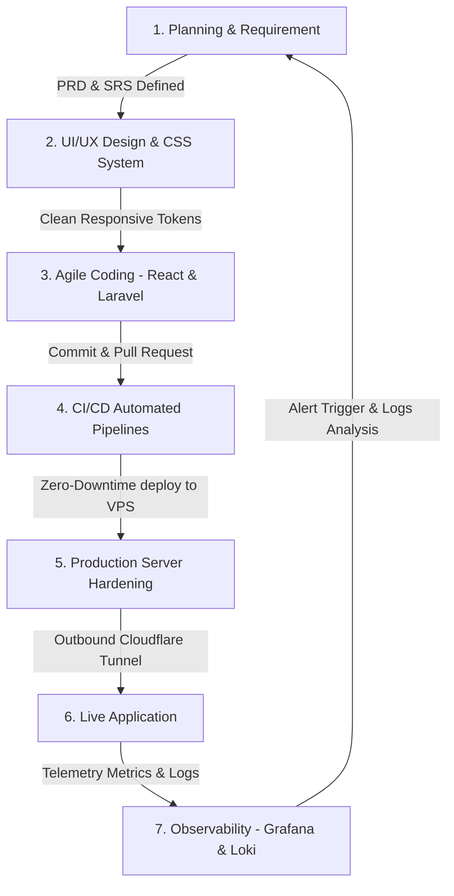

# 🏢 PRD, SRS, & SDLC Documentation - Wisma 46 Space

Dokumen induk ini memetakan visi produk (**PRD**), spesifikasi kebutuhan sistem (**SRS**), dan siklus hidup pengembangan (**SDLC**) berbasis DevOps yang diterapkan pada platform **Wisma 46 Space**.

---

## 🎯 Bagian 1: Product Requirement Document (PRD)

### 1.1 Visi & Tujuan Produk
**Wisma 46 Space** adalah sistem manajemen sewa ruang kantor (*office space*) modern yang dirancang untuk mengatasi tantangan pemesanan ruang fisik di area perkantoran premium Wisma 46. 

Tujuan utama sistem ini adalah:
* **Bagi Penyewa (User)**: Menyediakan platform pemesanan yang cepat, andal, anti-lag, serta dilengkapi asisten cerdas virtual AI yang siap membantu 24/7.
* **Bagi Operasional (Admin & Staf)**: Menyederhanakan proses verifikasi pembayaran, moderasi testimoni, manajemen kupon, dan komunikasi pesan bantuan secara langsung (*live chat*).

### 1.2 User Persona & Hak Akses (Role Matrix)

Sistem ini membagi pengguna ke dalam tiga peran utama dengan batasan akses (*RBAC - Role-Based Access Control*) yang jelas:

| Peran (Role) | Hak Akses Utama | Tujuan & Kebutuhan |
| :--- | :--- | :--- |
| **👤 User (Penyewa)** | Telusuri ruang, kalkulasi kupon promo, pilih fasilitas tambahan, lakukan sewa, perpanjang kontrak, beri rating, tanya jawab dengan AI Chatbot. | Mencari ruang kerja kosong dengan harga kompetitif dan mengajukan sewa tanpa prosedur administrasi manual yang lambat. |
| **🎧 Helpdesk (Staf)** | Masuk ke dashboard Live Chat untuk membantu user yang diekskalasi oleh AI Chatbot, kelola/konfirmasi pemesanan sewa. | Menangani keluhan teknis pengguna secara instan dan memproses status pemesanan sewa harian. |
| **🔑 Admin (Super User)** | Memiliki semua hak Helpdesk + CRUD ruangan, CRUD kupon diskon, moderasi ulasan rating, pantau dashboard analitik performa bisnis & server. | Mengawasi performa finansial platform, menjaga integritas ulasan publik, serta mengelola ketersediaan aset properti di Wisma 46. |

---

### 1.3 Kebutuhan Fitur Fungsional Utama (Functional Requirements)

1. **Dukungan Dua Bahasa Dinamis (Bilingual - ID/EN)**:
   * Seluruh komponen antarmuka, mulai dari beranda, form sewa, modul rating, hingga format berkas **Invoice PDF** dapat berganti bahasa secara instan di sisi klien tanpa perlu memuat ulang (*refresh*) halaman browser.
2. **Sistem Pemesanan Cerdas & Keterisian (Future Booking)**:
   * Jika suatu ruangan dalam status penuh (*fully booked*), sistem akan otomatis menampilkan peringatan tanggal ketersediaan terdekat dan mengatur isian formulir tanggal mulai sewa ke **H+1 setelah masa sewa saat ini berakhir**.
3. **Virtual Assistant AI Chatbot**:
   * Chatbot cerdas terintegrasi (menggunakan model Llama via API Groq) yang memahami zona waktu lokal WIB secara akurat guna memberikan salam waktu yang tepat (Pagi/Siang/Sore/Malam).
   * Bot memiliki instruksi ketat untuk membaca data keterisian ruangan terkini dari database, mengidentifikasi status "Tersedia" atau "Penuh", serta mendeteksi frasa darurat untuk mengalihkan obrolan secara otomatis ke admin/manusia menggunakan tag khusus `[REQUEST_HUMAN]`.
4. **Sistem Perpanjangan Kontrak Satu Klik**:
   * Memudahkan penyewa memperpanjang masa sewa ruang kerja mereka langsung dari daftar riwayat pesanan dengan membawa informasi referensi pesanan sebelumnya.
5. **Modul Kupon & Diskon Dinamis**:
   * Mendukung potongan harga dalam bentuk nominal (Rupiah) maupun persentase dengan pengecekan validasi kode promo secara real-time pada formulir sewa.

---

## 🛠️ Bagian 2: Software Requirement Specification (SRS)

### 2.1 Arsitektur & Teknologi Stack

Aplikasi ini dibangun menggunakan arsitektur modern berbasis kontainerisasi terisolasi (*Dockerized architecture*):

* **Frontend**: React.js (Vite) - UI dibangun menggunakan **Vanilla CSS** kustom yang dioptimalkan untuk meminimalkan beban rendering browser, mengadopsi variabel warna HSL dinamis (Dark/Light mode).
* **Backend**: Laravel 11 (RESTful API) - Bertanggung jawab atas logika bisnis, autentikasi sesi, pembuatan invoice PDF, dan manajemen database relasional.
* **Database**: MySQL 8.0.
* **Monitoring Stack**: Prometheus, Grafana, Loki, Promtail, dan Exporters.
* **Reverse Proxy**: Cloudflare Tunnel (`cloudflared`) - Menghubungkan jaringan internal Docker ke internet secara terenkripsi tanpa membuka port VPS ke internet publik (Zero Trust).

---

### 2.2 Kebutuhan Non-Fungsional (Non-Functional Requirements)

#### Performa & Optimalisasi Sumber Daya (Anti-Lag System)
* **Backend Database Caching**:
  * Mengurangi beban kueri relasional database yang berat menggunakan fasad `Cache::remember`.
  * Daftar ruangan di-cache selama **60 menit** menggunakan key dinamis harian `offices_list_YYYY-MM-DD`.
  * Statistik analitik dashboard admin di-cache selama **30 menit** (`admin_dashboard_stats`).
  * Sistem pembersihan cache otomatis (`Cache::flush()`) dipicu seketika saat ada perubahan data oleh Admin agar data real-time tetap sinkron.
* **Frontend Image Lazy Loading**:
  * Seluruh gambar ruangan di halaman beranda, daftar ruangan, ruangan populer, dan riwayat pesanan menggunakan atribut `loading="lazy"` agar browser hanya mengunduh gambar saat pengguna menggulir layar mendekatinya.
* **CSS Responsive Layouts (Mobile UX)**:
  * Menggunakan sistem konversi tabel data horizontal menjadi tata letak kartu informasi vertikal otomatis (*Mobile Card-List Layout*) saat lebar layar ponsel di bawah `768px`, mencegah scroll horizontal yang merusak UX.

#### Keamanan Infrastruktur (Secured Environment)
* **Docker Port Hardening**: Semua port eksternal layanan (kecuali SSH Port 22 untuk pengelolaan) hanya diikat (*binding*) ke interface loopback lokal `127.0.0.1` (localhost).
* **Network Isolation**: Komunikasi antar kontainer (misalnya Laravel ke MySQL, atau Promtail ke Loki) diselesaikan di dalam jaringan virtual Docker terisolasi (*bridge overlay network*).

---

## 🔄 Bagian 3: Software Development Life Cycle (SDLC)

Sistem **Wisma 46 Space** dikembangkan menggunakan siklus hidup **DevOps & GitOps Lifecycle** terpadu. Pendekatan ini menyatukan tim pengembang dengan manajemen infrastruktur server secara otomatis.

### 3.1 Detail Tahapan Siklus:
1. **Planning (Perencanaan)**: Penentuan batasan masalah dan fitur di dokumen PRD/SRS.
2. **Design (Desain)**: Pemetaan arsitektur basis data, serta implementasi sistem CSS berbasis variabel agar mudah diatur tata letaknya.
3. **Development (Pengembangan)**: Proses coding dengan prinsip pemisahan logika yang jelas. Mengembangkan REST API Laravel yang bersih, serta komponen React yang reusable.
4. **CI/CD Pipeline (Integrasi & Pengantaran Otomatis)**:
   * Setiap kali kode di-push ke branch utama (`main`), jalur pipeline otomatis memvalidasi kualitas sintaksis (*linting*).
   * Runner otomatis membangun Docker Image versi produksi yang bersih.
   * Melakukan pengantaran otomatis (*auto-deploy*) via koneksi SSH terenkripsi ke server VPS KVM target untuk memperbarui kontainer tanpa menghentikan layanan aplikasi (*Zero-Downtime*).
5. **Production Hardening (Pengamanan Server)**: 
   * VPS dikunci hanya menggunakan autentikasi SSH Key (mematikan opsi login password).
   * Memasang firewall kustom (UFW) di Ubuntu 22.04 LTS yang hanya mengizinkan port koneksi penting.
6. **Observability Loop (Pemantauan Berkelanjutan)**:
   * **Prometheus** merekam performa CPU/RAM dan status kontainer aktif secara real-time.
   * **Loki & Promtail** mengumpulkan log Laravel (`laravel.log`) dari folder penyimpanan kontainer.
   * **Grafana** memvisualisasikan seluruh metrik bisnis dan sistem ke dalam satu dashboard. Jika terjadi anomali (kontainer mati), sistem notifikasi alerting akan otomatis mengirimkan peringatan darurat ke administrator.
